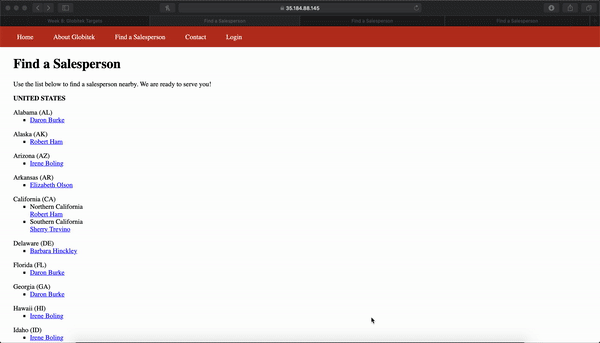
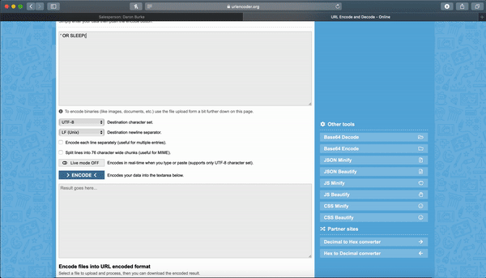
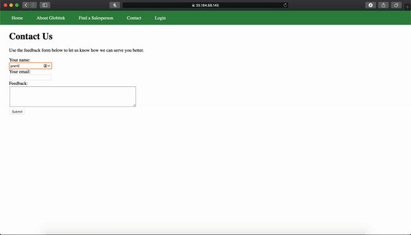
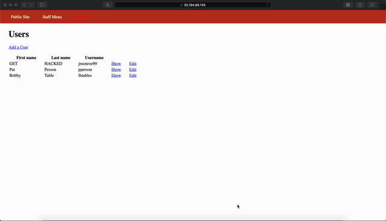
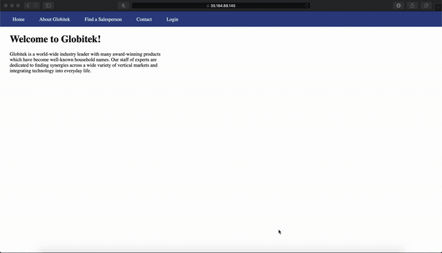

# Week 9 - Pentesting-Live-Targets

> Objective: For this assignment, you will attack three live targets, each of which is a slightly modified version of the same web application, Globitek. The three targets are therefore mostly identical. However, each target has been given a different color menu bar—blue, green, red—and each one has two different security vulnerabilities.

> Your challenge is to attempt to find and exploit the vulnerabilities. The goal is to identify which two vulnerabilities the blue target has, which two vulnerabilities the green target has, and which two vulnerabilities the red target has.
 Given ip: `https://35.184.134.15/`

## Goals

The following goals must be completed:

- [ ] **Vulnerability 1- Username Enumeration:** A careless developer mistake has created a username enumeration vulnerability. Determine which color has the vulnerability. You can use the existing username "jmonroe99" as a test. Next, figure out what mistake the developer made.

- <b> GREEN site has the vulnerability</b>

When an existing user tries to login with a wrong password on the Green site, we get an error message in bold. Otherwise, we get an unstrong error message.
  
  -  [ ] <b>GIF Walkthrough:</b>
       
       
  
- [ ] **Vulnerability 2- Insecure Direct Object Reference:** One of the three sites is missing code which would prevent some sensitive information from being made public. Determine which color has the vulnerability. Then, figure out what the other two sites did correctly to prevent the information leak.

- <b> RED site has the vulnerability</b>

We are able to access some confidential details of some salespersons by modifying the id parameter to generate a new GET request. We can access illegal id's 10 and 11. The Blue site & the Green site have prevented this kind of IDOR attack by redirecting the user to the original page whenever such an illegal id is requested.
```html
  		- ID: 1 NAME: Daron Burke
  		- ID: 2 NAME: Sherry Trevino
  		- ID: 3 NAME: Irene Boliing
  		- ID: 4 NAME: Robert Hamilton
  		- ID: 5 NAME: Ken Barker
  		- ID: 6 NAME: Elizabeth Olson
  		- ID: 7 NAME: Samuel Hunter
  		- ID: 8 NAME: Kim Stanley
  		- ID: 9 NAME: Barbara Hinckley
  		- ID: 10 NAME: Testy McTesterson  (ILLEGAL)
  		- ID: 11 NAME: Lazy Lazyman       (ILLEGAL)
  ```
  
   -  [ ] <b>GIF Walkthrough:</b>
       
       

- [ ] **Vulnerability 3- SQL Injection:** Most of the data input received by these websites is being sanitized properly. However, one of the three sites has one place where the input is not being sanitized before being used in an SQL query. Determine which color has the vulnerability.

- <b> BLUE site has the vulnerability</b>

We can pass a URL encoded SQL command as the id parameter to make the database sleep for 5 seconds. 
If we leave out the ' at the end, it says "database query failed". Hence, this site is vulnerable to sqli attacks.

 -  [ ] <b>GIF Walkthrough:</b>
       
       

  - [ ]  Injected URL Encoded SQL Command:
  ```html
  %27%20OR%20SLEEP(5)=0--%27
  ```

- [ ] **Vulnerabilty 4- Cross-Site Scripting:** All three sites do a good job of protecting against a reflected XSS attack. However, one of the sites has a mistake which leaves the site vulnerable to a stored XSS attack. A reflected XSS attack would be easy to reveal, while a stored XSS does not provide instant feedback. You will need to log into the admin area and look through the CMS in order to "spring the trap" and find out if your attack succeeded. Determine which color has the vulnerability. Remember, others will be attacking these sites alongside you. Use your name in the XSS so that your results won't be confused with anyone else's (example: <script>alert('Mallory found the XSS!');</script>).

- <b> GREEN site has the vulnerability</b>

We can use the feedback comment space to publish a javascript snippet as part of the comment and it is executed by the browser.

-  [ ] <b>GIF Walkthrough:</b>
       
  - 
       
  - [ ] Screenshot:
    

  - [ ] Injected Javascript Code:
  ```html

```
- [ ] **Vulnerability 5- Cross-Site Request Forgery:** One of the three sites does not have CSRF protections on the admin area. A clever attacker could design a form which would automatically submit form data to the staff area and take advantage of a logged in user's access permissions. Be the attacker and design a form which will make a change to the spelling of some database content. (For example, change the first user from "James" to "Jim", or change "Alabama" to "Alabamaaaa".) Then point the form action at each of the three sites to find out which color has the vulnerability. Do not neglect to be stealthy with your form—your unsuspecting, logged-in admin should neither see the form nor the results of the form submission.

- <b> RED site has the vulnerability </b>

A user with a random CSRF Token can also add/edit users. Walkthrough:
       
  - 
  
- [ ] **Vulnerabilty 6- Session Hijacking/Fixation:** Two of the three websites expire their active sessions and require users to re-login every 30 minutes. That is probably too aggressive for the real world, but it is better than the third site which allows sessions to be a year old, and never regenerates the session ID, even when the user agent string changes. This makes it vulnerable to both session hijacking and session fixation attacks.

There are many ways an attacker could get or set the session ID in the real world (XSS, sniffing WiFi packets, etc.). For this exercise, a PHP script has been provided to help you, "public/hacktools/change_session_id.php". You can load this script to find out the current session ID or to set it to a new one.

Use two different web browsers (e.g., Firefox and Chrome). Let one browser be the attacker and the other the target. Choose if you want to attempt a session hijacking or session fixation. For hijacking, log the target in first, then give the logged-in session ID to the attacker. For fixation, get a session ID for the attacker, give it to the target, then the target will log in. In both cases, the attacker should now have access to the staff area.

- <b> BLUE site has the vulnerability</b>

-  [ ] <b>GIF Walkthrough:</b>
       
  - 
